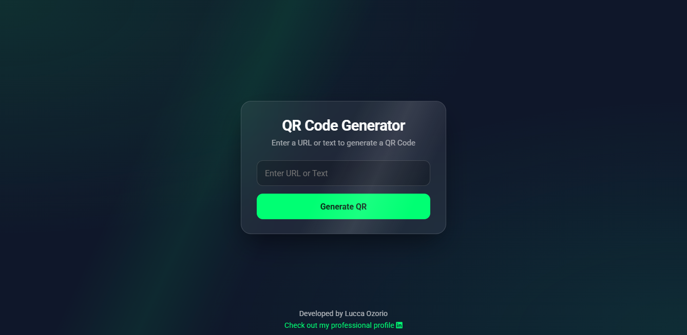

# ForgeQR



<p align="center">
  <a href="https://forgeqr.vercel.app/">
    
  </a>
  <a href="https://www.linkedin.com/in/luccaozorio">
    
  </a>
  <a href="mailto:luccaozorio272@gmail.com">
    
  </a>
  <a href="https://www.instagram.com/lucca.ozorio">
    
  </a>
</p>

---

**ForgeQR** is a fast, minimal, and elegant QR Code generator focused on simplicity, performance, and clean user experience.  
Built with pure HTML, CSS, and JavaScript. No frameworks. No distractions.

🔗 **Live demo:** https://forgeqr.vercel.app/

---

## ✨ Philosophy

Most QR code generators are bloated, outdated, or cluttered.  
ForgeQR was built with a single purpose:

> **Forge QR codes quickly, cleanly, and without friction.**

No accounts.  
No ads.  
No noise.

---

## 🚀 Features

- ⚡ **Instant QR Code Generation**  
  Generate QR codes from URLs or plain text in real time.

- 📱 **Fully Responsive**  
  Works perfectly on desktop, tablet, and mobile devices.

- 🧊 **Glassmorphism UI**  
  Modern glass-style interface with subtle visual effects.

- ⌨️ **Keyboard Support**  
  Press `Enter` to generate QR codes instantly.

- 🎯 **Minimal UX**  
  Clean interface focused entirely on usability.

---

## 🛠️ Tech Stack

- **HTML5** – Semantic and accessible structure  
- **CSS3** – Glassmorphism effects, animations, and responsive layout  
- **Vanilla JavaScript** – Lightweight logic and interactions  
- **QR Server API** – External API for QR code generation  

No build tools. No dependencies.

---

## 📖 How to Use

1. Open ForgeQR in your browser.
2. Enter a URL or any text.
3. Press **Enter** or click **Generate QR**.
4. Scan the generated QR code with any QR reader.

Simple by design.

---

## 🏗️ Local Setup

ForgeQR is a static project. To run it locally:

```bash
git clone https://github.com/yourusername/forgeqr.git
```

Open `index.html` in your browser.

---

## 🤝 Contributing

Contributions are welcome and appreciated.

- Bug fixes  
- UI/UX improvements  
- Performance optimizations  
- New features or ideas  

Feel free to open an issue or submit a pull request.

---

## 📄 License

This project is licensed under the **MIT License**.  
See the [LICENSE](LICENSE) file for more details.

---

## 👨‍💻 Author

**Lucca Ozorio**

- 💼 LinkedIn: https://www.linkedin.com/in/luccaozorio  
- 📸 Instagram: https://www.instagram.com/lucca.ozorio  
- ✉️ Email: luccaozorio272@gmail.com  

---

> **Forge your QR codes. Clean. Fast. Reliable.** ☕
